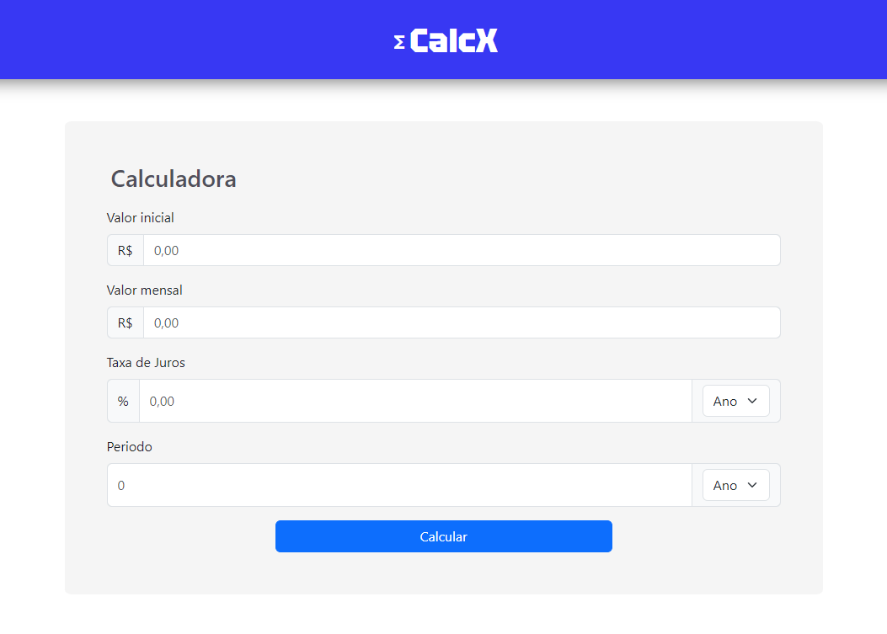
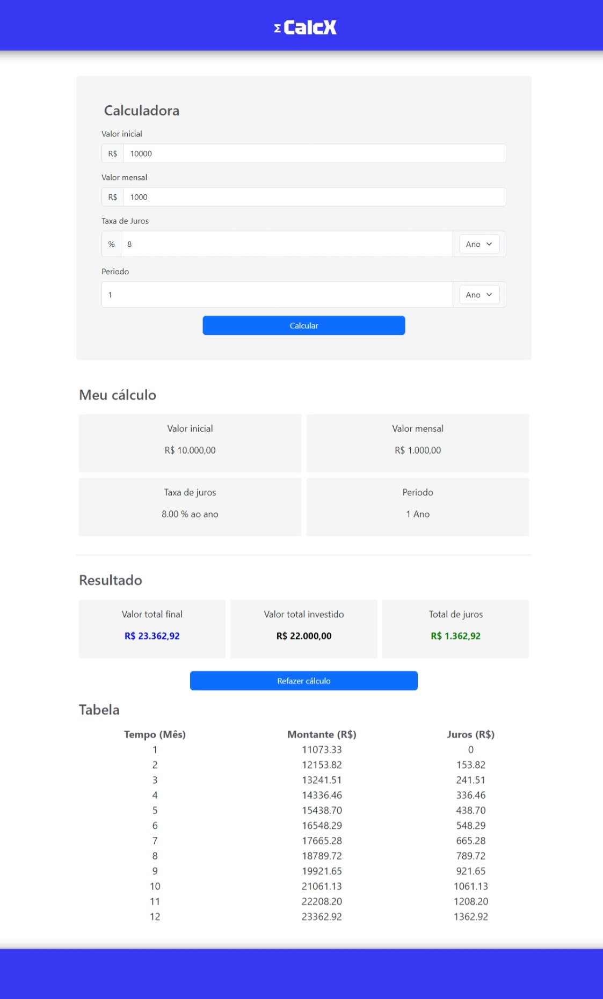
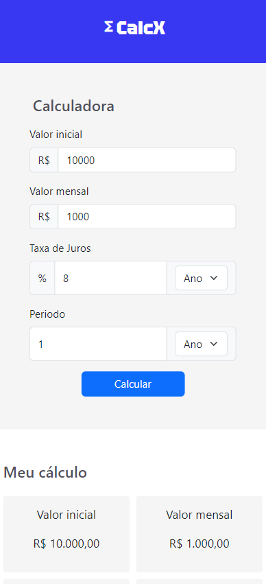

<html>

## Projeto CalcX

Esta é uma calculadora financeira com a finalidade de calculcar os juros e valor acumulado de um capital inicial com aportes mensais.

Seu funcionamento é bem simples, o usuário deve informar o **valor inicial**, **valor mensal** (aporte mensal), **taxa de juros** (em porcentagem por mês ou por ano) e o **periodo** do investimento, podendo ser em mês ou em ano.

<figcaption style="text-align: center; margin: 0 0 30px 0">Imagem 1: tela com os inputs.</figcaption>

Com os dados informados, basta apertar o botão **calcular** que a calculadora fará o resto. Abaixo está um exemplo fictício.

<figcaption style="text-align: center; margin: 0 0 30px 0">Imagem 2: tela com os resultados.</figcaption>

Caso o usuário queira fazer outro cálculo, basta apertar no botão **Refazer cálculo**.

## Mobile

A calculadora também está otimizada para mobile, com isso, o usuário pode aproveitar essa ferramente também no mobile.

<figcaption style="text-align: center; margin: 0 0 30px 0">Imagem 3: tela do mobile.</figcaption>

## Onde acessar?
Para ter acesso a calculadora CalcX, você pode acessar clicando 
[aqui](https://regal-starship-15fc72.netlify.app/).

</html>